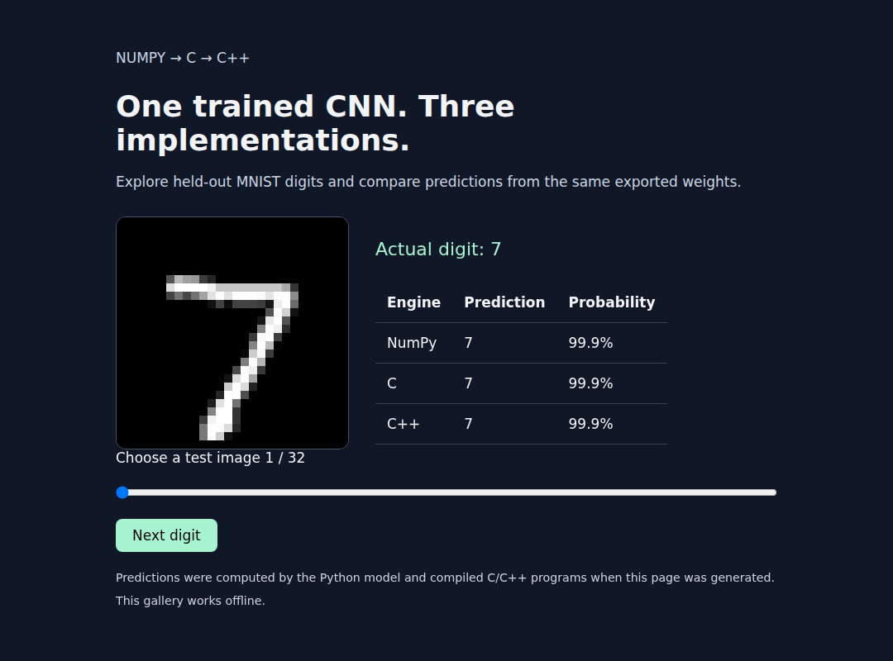
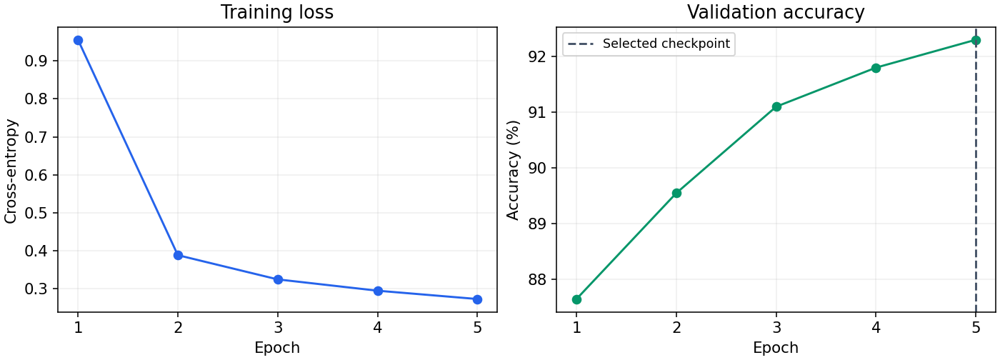
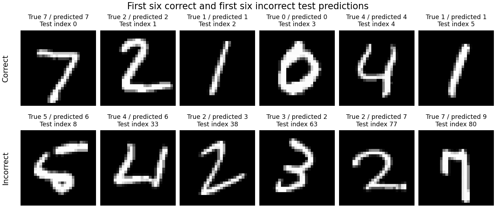

# CNN from scratch

Build a convolutional neural network with NumPy, run its learned weights in C and
C++, and explore the hardware building blocks in VHDL.

This is both a learning project and a small, tested inference engine. No
deep-learning framework is used to implement the network.

## Start here

| I want to… | Read |
|---|---|
| Understand how the CNN works | [Step-by-step guide](docs/guide.md) |
| Install dependencies and run it | [Setup and commands](docs/setup.md) |
| Follow the original learning sequence | [Lessons 1–7](lessons/README.md) |
| Understand the tests and results | [Verification guide](docs/verification.md) |
| Find a reference or project history | [Documentation index](docs/README.md) |
| Try the pre-trained model without training | [Model release guide](docs/release.md) |

## Project layout

```text
cnn-from-scratch/
├── docs/           Explanations, setup, references, and history
├── lessons/        Seven original learning stages
├── engine/         Reusable C/C++ layers and model serialization
├── trained/        NumPy training, native inference, verification, and demo
├── hardware/vhdl/  Integer convolution blocks and testbenches
├── tests/          Training and deployment regression tests
├── scripts/        Repository maintenance checks
├── reports/        Recorded accuracy and host benchmark results
└── build/          Generated training artifacts (ignored by Git)
```

Each main folder has its own README. The lessons explain the concepts;
`engine/` contains reusable implementation code; `trained/` connects training
to deployment.

## Quick start

Run from the repository root. You need Python 3.10+, GCC/G++, and Make.
See [setup](docs/setup.md) for package installation and optional VHDL tools.

```bash
python3 -m venv .venv
. .venv/bin/activate
python -m pip install -r requirements.txt
make test-software
make download
make train
make verify-trained
make demo
```

Open `build/trained/demo.html` in a browser. It is an offline gallery of held-out
images with NumPy, C, and C++ predictions, not a drawing recognizer.

Use `make help` for available commands. `make test` also requires GHDL and runs
the hardware and documentation checks. Tests do not download MNIST.

## What works today?

| Component | Recorded result | What it means |
|---|---|---|
| Trained NumPy CNN | 91.87% on 10,000 MNIST test images | The convolution and Dense weights were learned |
| Trained C/C++ deployment | 32/32 predictions agree with NumPy per engine | Exported samples agree at every checked layer |
| Small Day 7 golden model | Maximum absolute difference about `1.2e-10` | The frozen verification fixture agrees across float implementations |
| VHDL convolution tests | 384/384 values in each of two convolution benches | Integer convolution matches its reference vectors |

These are different checks, not one end-to-end FPGA result. The original Day 3
result of about 95% belongs to a **dense neural network**, not the CNN.
See the [recorded baseline](reports/trained-baseline.md) and
[verification boundaries](docs/verification.md).

The next substantial milestone is a calibrated integer version of the trained
CNN, followed by integration and measurement on actual FPGA hardware. See the
[technical roadmap](docs/roadmap.md) for deliverables and verification steps.

## See the results



The gallery works offline and its controls also fit a phone-sized browser.
Download instructions are in the [model release guide](docs/release.md).



The saved checkpoint classifies 9,187 of 10,000 test images correctly.
These examples show the first six correct and first six incorrect predictions
in test-set order, so both successes and limitations are visible.



See the [confusion matrix](docs/assets/confusion-matrix.png),
[evaluation data](reports/evaluation.json), and [release guide](docs/release.md).
Recreate these figures with `make evaluate` after installing
`requirements-release.txt`. Dataset credits are in [DATA_SOURCES.md](DATA_SOURCES.md).

## Finding files after the reorganization

Old `day1/`–`day7/` folders are now under `lessons/`; `vhdl/` is now
`hardware/vhdl/`. The former `UNDERSTAND.md` is now
[the main guide](docs/guide.md). Future milestones are in the
[technical roadmap](docs/roadmap.md); the original exercises are recorded in the
[learning log](docs/history/learning-log.md).

Author: Osama Z. · [MIT license](LICENSE)

[Contributing](CONTRIBUTING.md) · [Changelog](CHANGELOG.md)
